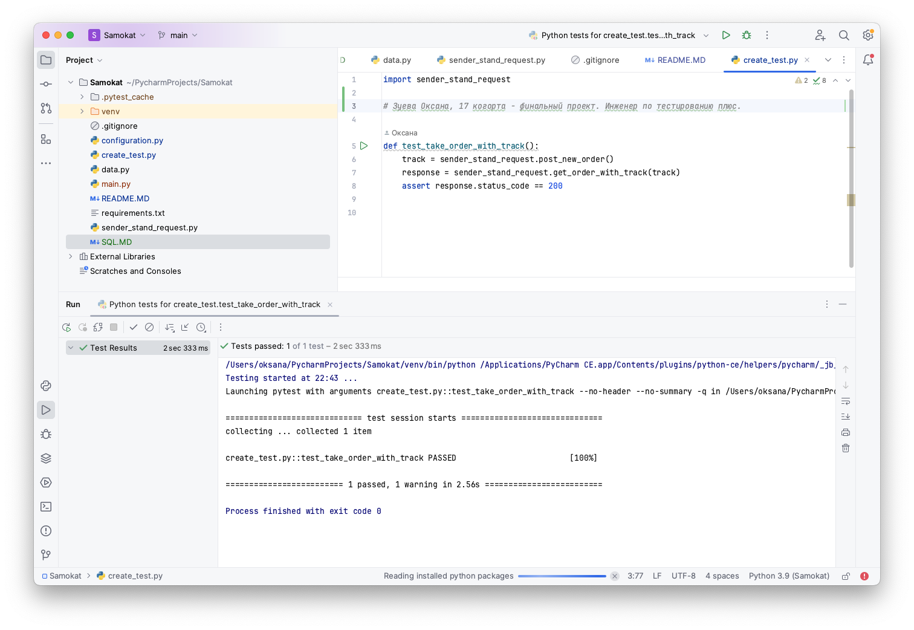

### Тесты на проверку получения данные о заказе по треку заказа.

Проверки выполняются с помощью API Яндекс.Самокат.
- Для запуска тестов должны быть установлены пакеты pytest и requests.
- Запуск всех тестов выполянется командой pytest.

Задание по SQL запросам: [SQL.MD](SQL.MD)

Скриншот успешного теста 
